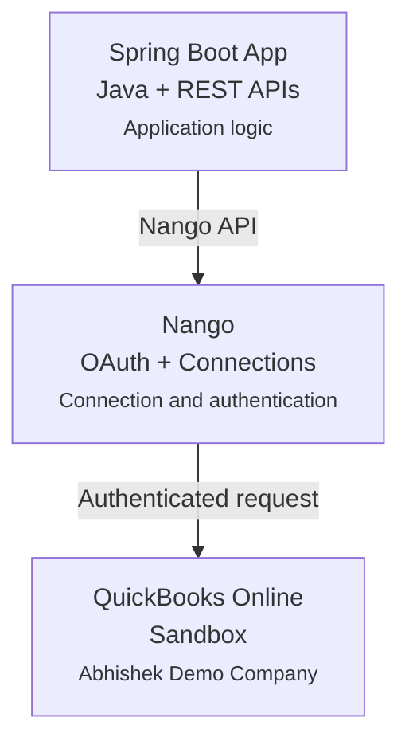

# QuickBooks Online Integration with Nango and Spring Boot

A simple example of integrating **Nango** with a **Java Spring Boot** application to connect with **QuickBooks Online**.

This project demonstrates how a Spring Boot backend can use Nango to manage a QuickBooks Online connection and access data such as company information, customers, and invoices.

The project uses a **QuickBooks Online Sandbox** environment, so it can be used for learning and experimentation without connecting to a production company.

---

## What this project demonstrates

- Connecting a Spring Boot application with Nango
- Creating a Nango Connect Session
- Connecting a QuickBooks Online Sandbox account
- Authorizing a QuickBooks Online connection
- Making authenticated requests through Nango
- Retrieving QuickBooks Online company information
- Retrieving customers
- Retrieving invoices
- Handling API errors in Spring Boot
- Verifying webhook signatures
- Testing the integration with JUnit

---

## Architecture

The integration follows this basic flow:



The Spring Boot application communicates with Nango, while Nango handles the connection with QuickBooks Online.

Once the connection is established, the application can make requests through Nango to retrieve data from the QuickBooks Online Sandbox.

---

## Technologies

- **Java 17+**
- **Spring Boot 3**
- **Maven**
- **Nango**
- **QuickBooks Online API**
- **OAuth 2.0**
- **REST APIs**
- **JUnit**

---

## Project Structure

The project is organized around a few main components:

```text
src/
├── main/
│   └── java/
│       └── com/example/nango/
│           ├── controller/
│           ├── service/
│           ├── client/
│           ├── model/
│           ├── exception/
│           └── webhook/
│
└── test/
    └── java/
```

The main responsibilities are:

| Component | Responsibility |
|---|---|
| Controller | Exposes REST endpoints for the demo |
| Service | Contains QuickBooks integration logic |
| Nango Client | Communicates with the Nango API |
| Model | Represents QuickBooks data |
| Exception Handler | Handles API errors |
| Webhook Verification | Verifies incoming webhook requests |

---

# Getting Started

## Prerequisites

Before running the project, you will need:

- Java 17 or higher
- Maven 3.6+
- A Nango account
- A QuickBooks Online Developer account
- A QuickBooks Online Sandbox company
- A QuickBooks integration configured in Nango

---

# 1. Create a QuickBooks Online Sandbox

QuickBooks Online provides a Sandbox environment for development and testing.

Create a developer account through the Intuit Developer Portal and create a Sandbox company.

For this project, the example company is:

**Abhishek Demo Company**

You can use your own QuickBooks Sandbox company when following this guide.

### Configure the QuickBooks application

When creating the application, configure the required QuickBooks Online permissions/scopes for the resources you want to access.

For this example, the application works with resources such as:

- Company information
- Customers
- Invoices

Make sure the required permissions are enabled for your application before connecting it through Nango.

---

# 2. Configure the QuickBooks Integration in Nango

Create a Nango account and configure the QuickBooks integration.

Nango is used in this project to manage the connection between the application and QuickBooks Online.

You will need the appropriate Nango configuration and secret key for the Spring Boot application.

The application reads the Nango secret from an environment variable:

```text
NANGO_SECRET_KEY
```

Keep this value private and do not commit it to GitHub.

---

# 3. Configure Environment Variables

Create a local `.env` file from the example environment file:

```bash
cp .env.example .env
```

Add the required configuration.

For example:

```text
NANGO_SECRET_KEY=your_nango_secret_key
```

Depending on the project configuration, additional environment variables may be required.

Never commit your `.env` file or credentials to source control.

---

# 4. Start the Application

### Windows

Run:

```powershell
.\run.ps1
```

### Linux / macOS

Run:

```bash
export $(cat .env | xargs)
mvn spring-boot:run
```

The application starts on:

```text
http://localhost:8080
```

---

# Connecting QuickBooks Online

## 5. Create a Nango Connect Session

The Spring Boot application exposes an endpoint for creating a Nango Connect Session.

Example:

```bash
curl -X POST http://localhost:8080/api/tenants/demo-company/accounting/connect
```

The application sends the request to Nango and receives a connection link.

Open the connection link and follow the authorization flow to connect the QuickBooks Online Sandbox.

After authorization, the connection can be used by the Spring Boot application for subsequent requests.

---

# Working with QuickBooks Data

Once the connection is established, the application can request data from QuickBooks Online through Nango.

## 6. Fetch Company Information

Use the following endpoint:

```bash
curl http://localhost:8080/api/tenants/demo-company/accounting/company
```

The Spring Boot application sends the request through Nango to QuickBooks Online.

Example response:

```json
{
  "CompanyName": "Abhishek Demo Company",
  "LegalName": "Abhishek Demo Company",
  "Country": "US",
  "FiscalYearStartMonth": "January"
}
```

The actual response depends on the information configured in your QuickBooks Sandbox company.

---

## 7. Fetch Invoices

The project also demonstrates retrieving invoices from QuickBooks Online.

Example:

```bash
curl "http://localhost:8080/api/tenants/demo-company/accounting/invoices?limit=2"
```

The application sends a QuickBooks query through Nango and maps the response to Java objects.

Example:

```json
[
  {
    "Id": "1",
    "DocNumber": "1001",
    "TxnDate": "2026-09-06",
    "TotalAmt": 362.07,
    "Balance": 362.07
  }
]
```

The actual data will depend on the invoices available in your Sandbox company.

---

## 8. Fetch Customers

Customers can be retrieved using the same integration flow.

Example:

```bash
curl "http://localhost:8080/api/tenants/demo-company/accounting/customers?limit=2"
```

Example response:

```json
[
  {
    "Id": "1",
    "DisplayName": "Demo Customer",
    "GivenName": "John",
    "FamilyName": "Doe",
    "Active": true
  }
]
```

The returned data depends on the customers available in your QuickBooks Sandbox.

---

# Webhooks

## 9. Webhook Verification

The project includes an example of verifying webhook requests.

When a webhook is received, the application verifies the request signature using **HMAC-SHA256** before processing the request.

The application uses Spring's request caching support so that the request body can be used for both signature verification and JSON deserialization.

This provides a simple example of handling signed webhook requests in a Spring Boot application.

---

# Error Handling

## 10. API Error Handling

The application includes basic handling for errors returned by Nango and the connected provider.

Some examples include:

- `404 Not Found`
- `424 Failed Dependency`
- `429 Too Many Requests`

The application maps these errors into appropriate API responses using Spring's `ProblemDetail` support.

This keeps errors returned by the integration understandable to clients of the Spring Boot API.

---

# Testing

## 11. Run the Tests

The project includes tests for the main integration components.

Run:

```bash
mvn test
```

The test suite covers areas such as:

- Nango client behavior
- Webhook signature verification
- Controller behavior
- HTTP error handling

The tests are designed so that the main test suite does not require a live QuickBooks connection.

---

# Example Endpoints

The demo application exposes endpoints similar to:

| Method | Endpoint | Description |
|---|---|---|
| `POST` | `/api/tenants/{tenantId}/accounting/connect` | Create a Nango connection session |
| `GET` | `/api/tenants/{tenantId}/accounting/company` | Retrieve company information |
| `GET` | `/api/tenants/{tenantId}/accounting/invoices` | Retrieve invoices |
| `GET` | `/api/tenants/{tenantId}/accounting/customers` | Retrieve customers |

The exact endpoints may vary depending on the implementation.

---

# Why Nango?

This project uses Nango as the connection layer between the Spring Boot application and QuickBooks Online.

Instead of implementing the connection flow directly inside the application, the project delegates the connection and authentication workflow to Nango.

This allows the Spring Boot application to focus on the application logic and the data it needs from QuickBooks Online.

The same approach can be useful when working with multiple external services and integrations.

---

# Project Goal

The goal of this project is to provide a **small and practical example of using Nango with Java and Spring Boot**.

It demonstrates the complete flow from creating a connection to accessing data from a QuickBooks Online Sandbox.

The project is intended to be easy to understand and useful as a starting point for developers who want to experiment with Nango from a Java backend.

---

# Disclaimer

This repository is a **learning and demonstration project**.

It is intended to demonstrate the integration flow between Spring Boot, Nango, and QuickBooks Online Sandbox. The implementation may need additional configuration, validation, error handling, monitoring, and security considerations before being used in a real application.

---

# License

This project is available for learning and experimentation.
